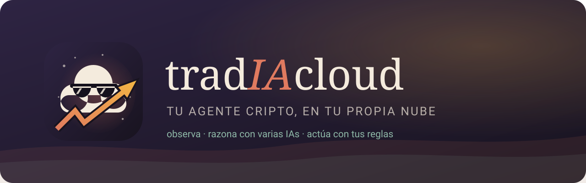

<p align="center"></p>
<h1 align="center">TradIA Cloud</h1>
<p align="center"><a href="https://tradiabot.github.io/tradia-cloud/"><b>🌐 Página oficial</b></a> · <a href="README.en.md">English</a> · <a href="AVISO-LEGAL.md">Aviso legal</a> · <a href="LICENSE">Licencia MIT</a></p>
<p align="center"><b>Agente de trading cripto que vive en <i>tu propia nube</i>, con tus claves y tus reglas.</b><br>
App Android · Cloudflare Workers · GitHub Actions · varias IAs gratis con consenso · exchanges vía ccxt</p>

---

> [!IMPORTANT]
> **TradIA Cloud NO es un exchange, ni un bróker, ni una billetera, ni un servicio de inversión.**
> Es software libre que *enlaza* tu propia cuenta de exchange con tu propia nube. No recibe, no guarda
> y no mueve dinero de nadie: las órdenes las ejecuta **tu** exchange con **tus** claves.
> No es asesoría financiera. Lee el [aviso legal](AVISO-LEGAL.md) antes de usarlo con dinero real.

## ¿Qué es un agente?

Un *bot* sigue reglas fijas. Un **agente** cumple un objetivo que tú le das y decide cómo, dentro de límites que no puede cruzar:

| Paso | Qué hace TradIA |
|---|---|
| **Observa** | Cada 30 min lee tus saldos, precios, RSI/MACD, el mercado global (BTC, ETH, bolsa, oro, petróleo) y titulares de las últimas 24 h. |
| **Razona** | Consulta a **varias IAs gratis** a la vez (Groq, Gemini, OpenRouter, Cerebras, Mistral o sin clave como Kilo). Votan y gana el **consenso**; si no se ponen de acuerdo, baja la confianza o espera. |
| **Actúa** | Propone órdenes que tú apruebas, editas o cancelas, o las ejecuta sola si se lo permites. |
| **Respeta límites** | Monto máximo por operación, **nunca vende con pérdida** (por defecto), **🪙 Acumular**: monedas como BTC que compra pero nunca vende sola. |
| **Reporta** | Historial de cada ciclo, cada voto de la IA y cada orden, semáforo de salud y avisos en el teléfono. |

## Para compartir: cada quien usa SU nube y SUS claves

Esta app se publica **vacía**. No trae claves, cuentas ni APIs de nadie, tampoco del autor. Cada persona
instala su propia copia en sus cuentas gratis:

- **GitHub**: tu repositorio privado `tradia-nube` ejecuta el agente cada 30 min y guarda tus claves como *secretos cifrados*.
- **Cloudflare**: tu Worker guarda la configuración y el estado y es la dirección a la que se conecta la app.
- **IA**: Kilo funciona sin cuenta; o pega claves gratis de Groq, Google AI Studio, OpenRouter, Cerebras o Mistral. Puedes poner varias: si una falla, responde la siguiente.
- **Exchange**: API key **solo con lectura y trading, nunca con retiros**.

Nadie más ve tus claves ni tu cartera, ni siquiera quien mantiene este repositorio. No hay un servidor central.

## Modelos de IA

Todos son **gratis** y compatibles con OpenAI. Al guardar una clave, la nube revisa qué modelos tiene
esa cuenta (`/models`) y **elige sola** los mejores para chat, así que los nombres se actualizan sin tocar código.
Con **consenso** activo votan 2 a 5 modelos de proveedores distintos y, si uno falla, responde el siguiente.

| Proveedor | ¿Clave? | Modelos que usa TradIA | Consigue tu clave |
|---|---|---|---|
| [Groq](https://console.groq.com/docs/models) | Sí, gratis | [`openai/gpt-oss-120b`](https://huggingface.co/openai/gpt-oss-120b), [`qwen/qwen3.8-27b`](https://huggingface.co/Qwen) | [console.groq.com/keys](https://console.groq.com/keys) |
| [Google Gemini](https://ai.google.dev/gemini-api/docs/models) | Sí, gratis | El `gemini-X.Y-flash` más nuevo de tu cuenta | [aistudio.google.com/apikey](https://aistudio.google.com/apikey) |
| [OpenRouter](https://openrouter.ai/models?max_price=0) | Sí, gratis | Solo modelos que terminan en `:free` | [openrouter.ai/keys](https://openrouter.ai/keys) |
| [Cerebras](https://inference-docs.cerebras.ai/models/overview) | Sí, gratis | gpt-oss-120b / Qwen grandes, según tu cuenta | [cloud.cerebras.ai](https://cloud.cerebras.ai) |
| [Mistral](https://docs.mistral.ai/getting-started/models/) | Sí, plan «Experiment» | `mistral-small-latest` y similares | [console.mistral.ai/api-keys](https://console.mistral.ai/api-keys) |
| [Kilo](https://kilo.ai) | **No** | [`nvidia/nemotron-3-super-120b-a12b:free`](https://huggingface.co/nvidia), `nvidia/nemotron-3-ultra-550b-a55b:free`, `poolside/laguna-s-2.1:free` | — |
| [LLM7](https://llm7.io) | **No** | `GLM-5.3-Flash`, `gpt-oss:20b`, `DeepSeek-V4-Flash` | — |
| [OVH AI Endpoints](https://endpoints.ai.cloud.ovh.net) | **No** | `gpt-oss-120b`, [`Meta-Llama-3_3-70B-Instruct`](https://huggingface.co/meta-llama/Llama-3.3-70B-Instruct), `Qwen3.8-27B` | — |

> Los planes gratis tienen límites por minuto o por día y los modelos `:free` cambian seguido. En la app,
> Config → IA → **▶ PROBAR** muestra qué modelos responden ahora mismo y cuánto tardan.

## Instalación (desde la app)

1. Descarga la APK de [Releases](../../releases) e instálala en Android.
2. Elige **Crear mi nube** y sigue el asistente:
   - **GitHub**: token clásico con permisos `repo` y `workflow` (el enlace ya los marca).
   - **Cloudflare**: API token con la plantilla **«Edit Cloudflare Workers»**.
   - **IA** (opcional): Kilo sin clave, o claves gratis de Groq / Gemini / OpenRouter / Cerebras / Mistral.
   - **Exchange**: o empieza sin claves, solo en simulación.
3. La app crea `tu-usuario/tradia-nube` (privado) desde esta plantilla, guarda las claves cifradas,
   despliega el Worker en tu Cloudflare y lanza el primer ciclo **en simulación**.
4. Cuando lo tengas claro: Config → **Activar dinero real** (doble confirmación).

## Exchanges

| Exchange | Notas |
|---|---|
| **Hyperliquid** (DEX, sin KYC) | Dirección + clave de una *API wallet* que opera pero no puede retirar. Orden mínima ~10 USDC. |
| **MEXC** (sin KYC) | Cuenta sin verificar, con límite de retiro. |
| Crypto.com App / Exchange, Kraken, Coinbase Advanced, Bitstamp, Gate | API key con trading, sin retiros. |
| Otro | Cualquier id de [ccxt](https://github.com/ccxt/ccxt). |

Binance, Bybit, OKX, KuCoin y Bitget **no se ofrecen** porque bloquean los servidores de EE. UU. donde corre GitHub Actions.

## Funciones

- **Simulación primero**: cartera virtual con precios reales.
- **Consenso entre IAs**: votan 2 a 5 IAs; gana la acción con más confianza sumada, y un empate da ESPERAR. Las claves de IA se guardan cifradas (AES-GCM) y en la app solo se ven recortadas.
- **Órdenes con IA**: «Pedir a la IA» en lenguaje natural, editar las sugeridas, precio límite y caducidad.
- **Candado de pérdidas**: ninguna venta automática por debajo de tu costo + comisión, ni si el costo es desconocido. Solo pasan tus órdenes manuales.
- **🪙 Acumular**: BTC u otras monedas que el agente compra pero nunca vende sola.
- **Radar** de monedas con análisis de IA, **gráficas** (precio, costo promedio, RSI, MACD) y **predicciones de Hyperliquid** (solo sugerencias).
- **Semáforo** de nube, ciclos, IA y exchange, con «Buscar y corregir».
- **Modo simple**, 5 temas visuales y avisos nativos en Android.

## Arquitectura

```
 App Android ──HTTPS + token──▶ Worker en TU Cloudflare (config, estado, IA, avisos)
                                      ▲
                                      │ reporte de cada ciclo
 GitHub Actions en TU repo privado ───┘  (cada 30 min: observa, consulta a las IAs, opera con ccxt)
   └─ secretos cifrados: claves del exchange, IA, Cloudflare
```

- `runner/`: motor en Python (estrategia, IA y consenso, adaptadores de exchange). Pruebas: `cd runner && python -m unittest discover -s tests`.
- `worker/`: API de la nube (TypeScript + KV). Nunca recibe las claves del exchange.
- `.github/workflows/`: `instalar.yml` (despliega la nube), `ciclo.yml` (un ciclo cada 30 min) y `diagnostico.yml` (revisa sin imprimir claves).
- `app/android/`: app nativa con WebView (`assets/www/index.html`). Pruebas de interfaz: `cd app/pruebas && npm i && node ui.test.js`.

## Límites del plan gratis

- **GitHub Actions** (repo privado): 2.000 min/mes; un ciclo cada 30 min usa ~1.440.
- **Cloudflare Workers/KV**: unas 5 escrituras por ciclo (~250/día), bajo el límite gratis de 1.000.

## Seguridad

- Las claves del exchange solo existen como secretos cifrados de **tu** repositorio.
- El teléfono guarda solo la dirección de tu nube, su token y, si quieres, el token de GitHub (para «Ciclo ahora»). Se borra en Config.
- Crea siempre claves de exchange **sin permiso de retiro**.
- ¿Encontraste una falla de seguridad? Abre un *issue* sin datos sensibles.

## ☕ Apoya al desarrollador

TradIA es gratis y abierto. Si te sirve, puedes invitar un café al desarrollador con una donación voluntaria:

<table>
<tr>
<td align="center" width="50%">
<br><b>Bitcoin (BTC)</b><br><br>
<br>
<sub><code>bc1qd9j45f4t0jwyhjhqh2kvz2cr7k8xye460rr2y7</code></sub>
</td>
<td align="center" width="50%">
<br><b>Monero (XMR)</b><br><br>
<br>
<sub><code>447gTj6Hg6gaAEAUmjqfhqDZr1PziUTvbT4LYLpmLVnTNVFK6cqeqPfh6P4neMKLWX5jDXAr94fWHacJwDvjmCzBBH8wPBt</code></sub>
</td>
</tr>
</table>

Envía solo **BTC por la red Bitcoin** a la dirección de Bitcoin y solo **XMR** a la de Monero. También puedes donar desde la app: **Config → Apoya al desarrollador**.

> ⚠️ El trading de criptomonedas tiene alto riesgo y puedes perder todo lo que inviertas. TradIA Cloud no es asesoría financiera ni un exchange. Ver [AVISO-LEGAL.md](AVISO-LEGAL.md).

Licencia [MIT](LICENSE) © 2026 TradIA Cloud contributors. Marca e íconos: `docs/marca/generar.py`.
